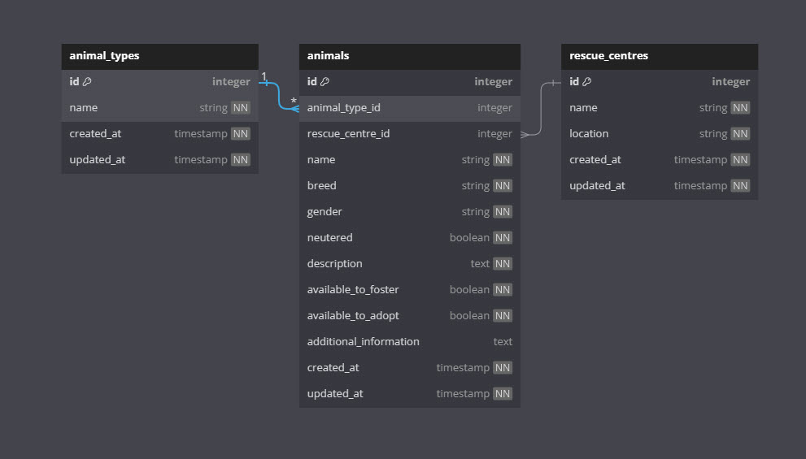

# Dummy Data

Now that you've had the chance to experiment with creating data models and migrations (and quite possibly factories and controllers as well) it's time to look at how we can add some data into those tables to aid our development.

When our application is finally deployed the database itself will probably be empty of data or at least the vast majority of it will be. During the building phase though having mock data to use will be very beneficial. It will allow us to test the application thoroughly and it will also help when it comes to designing the views that are going to be used to both display and enter data.

Study this section carefully and make sure that you really understand the concepts. You'll be doing this a lot and it needs to become second nature.

<br>

## Common Php Commands

<br>

Before getting started lets familiarise ourselves with some of the basic php artisan commands that we'll find ourselves using most of the time in relation to migrations.

- `php artisan migrate`

This is the basic migration command that will, on the first occasion it's run also create the database for you.

- `php artisan db:seed`

This will seed your database with dummy data.

- `php artisan migrate:reset`

This will remove all of the migrations that have been made.

- `php artisan migrate:refresh`

migrate:refresh rolls back all of the migrations that have been made and then re runs php artisan migrate.

- `php artisan migrate:fresh`

This command drops all of the tables in the database, effectively leaving it empty and it will then go on to run the migrate command.

- `php artisan migrate:fresh --seed`

By adding --seed to the command the database tables created will be seeded with data.

In reality the last command may well be the one that gets used most often after the original php artisan migrate.

Whilst by no means a complete list these commands are almost certainly the ones that you will find yourself using the most often

<br>

## Seed - a definition

<br>

You will come across the word seed often in relation to databases and it generally refers to populating the database with fake data (usually for the purposes of testing and development).

That seeding is often done with the help of a special code library ([Faker](https://fakerphp.github.io/)) created specifically to make the job of creating fake 'realistic' data that bit easier.

The Faker library though also has it's own Seed definition. A Seed for Faker is a means by which it is possible to ensure that Faker always generates exactly the same 'realist' data for the database no matter how many times the tables are emptied and re-seeded. This is a particularly useful facility to use especially during development because it enables you to predict what results you should be seeing when you do certain things.

<br>

## Our First batch of dummy data

<br>

If you look in your app in the database folder you'll see a folder called seeders in which there is a single class DatabaseSeeder

<br>

```php
<?php

namespace Database\Seeders;

// use Illuminate\Database\Console\Seeds\WithoutModelEvents;
use Illuminate\Database\Seeder;

class DatabaseSeeder extends Seeder
{
    /**
     * Seed the application's database.
     */
    public function run(): void
    {
        // \App\Models\User::factory(10)->create();

        // \App\Models\User::factory()->create([
        //     'name' => 'Test User',
        //     'email' => 'test@example.com',
        // ]);
    }
}
```

<br>

If you look closely at the code that is commented out in the `run()` method you'll see reference to factory. Factories are what Laravel now uses as the main way to add fake data to tables. Indeed depending on how you chose to create your models for the exercise at the end of the Data Models section you may well have created factories at the same time as you created the models.

Let's look at the User Factory created by default with your base application (it's in database/factories).

<br>

```php
<?php

namespace Database\Factories;

use App\Models\Team;
use App\Models\User;
use Illuminate\Database\Eloquent\Factories\Factory;
use Illuminate\Support\Str;
use Laravel\Jetstream\Features;

/**
 * @extends \Illuminate\Database\Eloquent\Factories\Factory<\App\Models\User>
 */
class UserFactory extends Factory
{
    /**
     * Define the model's default state.
     *
     * @return array<string, mixed>
     */
    public function definition(): array
    {
        return [
            'name' => $this->faker->name(),
            'email' => $this->faker->unique()->safeEmail(),
            'email_verified_at' => now(),
            'password' => '$2y$10$92IXUNpkjO0rOQ5byMi.Ye4oKoEa3Ro9llC/.og/at2.uheWG/igi', // password
            'two_factor_secret' => null,
            'two_factor_recovery_codes' => null,
            'remember_token' => Str::random(10),
            'profile_photo_path' => null,
            'current_team_id' => null,
        ];
    }

    /**
     * Indicate that the model's email address should be unverified.
     */
    public function unverified(): static
    {
        return $this->state(function (array $attributes) {
            return [
                'email_verified_at' => null,
            ];
        });
    }

    /**
     * Indicate that the user should have a personal team.
     */
    public function withPersonalTeam(callable $callback = null): static
    {
        if (! Features::hasTeamFeatures()) {
            return $this->state([]);
        }

        return $this->has(
            Team::factory()
                ->state(fn (array $attributes, User $user) => [
                    'name' => $user->name.'\'s Team',
                    'user_id' => $user->id,
                    'personal_team' => true,
                ])
                ->when(is_callable($callback), $callback),
            'ownedTeams'
        );
    }
}
```

<br>

Look at the code in the `definition()` unction and compare that with the actual User Model and you'll quickly see that the factory is being used to generate data to put into each user field.

Now uncomment this line in the run method of the DatabaseSeeder

` // \App\Models\User::factory(10)->create();`

When you've done that run the following command at the terminal;

<br>

`php artisan db:seed`

<br>

Open up the Sqlite database in DB Browser and look at Browse the data in the users table

You should see 10 entries. Make a note of the name in the first row.

Now run the following command at the terminal;

<br>

`php artisan migrate:fresh --seed`

Close the database in DB Browser (if it is still open) then reopen it and browse the data in the users table. You'll see 10 records again but they'll be completely different.

In most cases this probably wont matter but there will be occasions when having the same data really helps. Let's do something about that.

<br>

### Seeding the Faker

<br>

Return to the DatabaseSeeders file and amend it so that it now looks like this;

<br>

```php
<?php

namespace Database\Seeders;

// use Illuminate\Database\Console\Seeds\WithoutModelEvents;
use Faker\Generator;
use Illuminate\Database\Seeder;

class DatabaseSeeder extends Seeder
{
    /**
     * Seed the application's database.
     */
    public function run(Generator $faker): void
    {
        $faker->seed(100);
         \App\Models\User::factory(10)->create();

        // \App\Models\User::factory()->create([
        //     'name' => 'Test User',
        //     'email' => 'test@example.com',
        // ]);
    }
}
```

<br>

Save everything and then once again run the command

`php artisan migrate:fresh --seed`

Examine the users table once again, making a mental note of the entries.

Now run the command again, close DB Browser (if you hadn't already) reopen the it, open the database and browse the data in the users table. This time it will be the same as before.

You can now generate consistent random data time after time after time.

<br>

## Generating data for the new data models

<br>

At the end of the last section if you followed the exercise there were three data models to be added. Whilst these will probably change a bit they are certainly useful to use as test cases to demonstrate how to go about customising the factory classes to create data that we'll be able to use constructively as we build out the application.

Let's quickly remind ourselves of the models in question.

<br>



<br>

When fake data is constructed that involves related tables careful attention needs to be paid to the relationship types. In the case of one to many relationships the one part will need to exist before the many part can ce created. What that boils down to is that before we consider creating fake data for the animals table we'll need to have data in both the animal_types table and the rescue_centres table.

<br>

### Animal_Types

<br>

Using Laravel Idea to create the Animal_Type model and associated factory led to this being created;

<br>

```php
<?php

namespace Database\Factories;

use App\Models\AnimalType;
use Illuminate\Database\Eloquent\Factories\Factory;
use Illuminate\Support\Carbon;

class AnimalTypeFactory extends Factory
{
    protected $model = AnimalType::class;

    public function definition(): array
    {
        return [
            'name' => $this->faker->name(),
            'created_at' => Carbon::now(),
            'updated_at' => Carbon::now(),
        ];
    }
}
```

<br>

Looking at the Faker documentation it soon becomes apparent that it has no ready made option for actual animal genus names. Whilst we could ignore that and go with just conventional first names it would be much easier to have something specific. As we could make do with just Dog and Cat for the time being let's just create two specific records.

Make the following change to the DatabaseSeeder.

<br>

```php
<?php

namespace Database\Seeders;

// use Illuminate\Database\Console\Seeds\WithoutModelEvents;
use Doctrine\DBAL\Schema\Sequence;
use Faker\Generator;
use Illuminate\Database\Seeder;

class DatabaseSeeder extends Seeder
{
    /**
     * Seed the application's database.
     */
    public function run(Generator $faker): void
    {
        $faker->seed(100);
         // \App\Models\User::factory(10)->create();

        \App\Models\AnimalType::factory()
            ->count(2)
            ->sequence(
                ['name' => 'Dog'],
                ['name' => 'Cat'],
            )
            ->create();
        // \App\Models\User::factory()->create([
        //     'name' => 'Test User',
        //     'email' => 'test@example.com',
        // ]);
    }
}
```

<br>

What is going on here? Put simply we are instructing the AnimalTypeFactory to create two records. As those records are created the value entered into the 'name' field is to come from the pre defined sequence that has been provided.

Run the command `php artisan migrate:fresh --seed` and then examine the database and specifically the values added to the animal_types table. You'll see two records, one for Dog and one for Cat.

<br>

### Rescue_Centres

The default RescueCentreFactory created by Laravel Idea looked like this;

<br>

```php
<?php

namespace Database\Factories;

use App\Models\Rescue_Centre;
use Illuminate\Database\Eloquent\Factories\Factory;
use Illuminate\Support\Carbon;

class Rescue_CentreFactory extends Factory
{
    protected $model = Rescue_Centre::class;

    public function definition(): array
    {
        return [
            'name' => $this->faker->name(),
            'location' => $this->faker-word(),
            'created_at' => Carbon::now(),
            'updated_at' => Carbon::now(),
        ];
    }
}
```

<br>

there are two things that aren't going to work with this, the first is the choice of word() for producing location. We could really do with something a little more meaningful here Faker does have a city() option but that will be determined by the default locale used for the faker. In a default Laravel app that's going to be 'en-US'. As I'm based in the UK that ought to be changed.

Open the app.php file and find the `'faker_locale' => 'en_US',` entry. Change it to what suits you.

With that done we'll make some small changes to the RescueCentreFactory.

<br>

```php
<?php

namespace Database\Factories;

use App\Models\Rescue_Centre;
use Illuminate\Database\Eloquent\Factories\Factory;
use Illuminate\Support\Carbon;

class Rescue_CentreFactory extends Factory
{
    protected $model = Rescue_Centre::class;

    public function definition(): array
    {
        $town = $this->faker->city();
        return [
            'name' => $town.' Animal Rescue Centre',
            'location' => $town,
            'created_at' => Carbon::now(),
            'updated_at' => Carbon::now(),
        ];
    }
}
```

<br>

What's going on here? For each record that gets created we're initially generating a city. That city will be used for the location but we also want a meaningful name for the rescue centre as well so generating it first and ten using it in two bits of the generator makes sense.

Now amend the DatabaseSeeder.

<br>

```php
<?php

namespace Database\Seeders;

// use Illuminate\Database\Console\Seeds\WithoutModelEvents;
use Doctrine\DBAL\Schema\Sequence;
use Faker\Generator;
use Illuminate\Database\Seeder;

class DatabaseSeeder extends Seeder
{
    /**
     * Seed the application's database.
     */
    public function run(Generator $faker): void
    {
        $faker->seed(100);

        \App\Models\AnimalType::factory()
            ->count(2)
            ->sequence(
                ['name' => 'Dog'],
                ['name' => 'Cat'],
            )
            ->create();

        \App\Models\Rescue_Centre::factory(10)->create();

    }
}
```

<br>

Once again run the command `php artisan migrate:fresh --seed` and then examine the database and very specifically the data in the rescue_centres table. There should be ten entries with correctly configures names for the rescue centres.

<br>

### Animals

<br>

Creating records for the animals table will not be quite so straightforward. In the fist case there are going to need to be direct links to actual records in both the animal_types and rescue_centres tables. As we kept the number of records created for each of those to a relatively small fixed limit (and rather usefully in this instance) went with the default incremental integer as a primary key that Laravel does by default) we can simply pick random integer values from the ranges we know to exist ( 1-2 and 1-10 ).

Breed will need to reflect dog or cat breeds.

The gender field will need to be one of Male or Female.

Most rescue centres neuter the animals before allowing them to be adopted so we want to reflect that bias in the data we create.

Lastly an animal that may not be ready for adoption may still be a suitable candidate for foster but an animal that isn't suitable to foster definitely won't be ready for adoption, a fact which we will also need to try and replicate realistically.

Here is the current definition for Animal in the Factory.

<br>

```php
    public function definition(): array
    {
        return [
            'name' => $this->faker->name(),
            'breed' => $this->faker->word(),
            'gender' => $this->faker->word(),
            'neutered' => $this->faker->boolean(),
            'description' => $this->faker->text(),
            'available_to_foster' => $this->faker->boolean(),
            'available_to_adopt' => $this->faker->boolean(),
            'additional_information' => $this->faker->word(),
            'created_at' => Carbon::now(),
            'updated_at' => Carbon::now(),
        ];
    }
```

<br>

Let's start to work through this.

'name' we can live with it really doesn't matter what gets generated.

We don't have anything for the animal_type_id and that is required. There are only two records so a simple integer choice of either 1 or 2 should suffice. We can achieve that like this `'animal_type_id'=>$this->faker->numberBetween(1, 2)` and by extension we get `'rescue_centre_id'=>$this->faker->numberBetween(1, 10)`.

'breed' is going to require something specific to the animal type. For that we'll probably need an if statement based on the value allotted to animal type.

'gender' has to be Male or Female. this should suffice `'gender' => $this->faker->randomElements(['Male','Female'])`

'available_to_adopt' is also going o require some sort of conditional.

Time to see what we can devise.

<br>

```php
<?php

namespace Database\Factories;

use App\Models\Animal;
use Illuminate\Database\Eloquent\Factories\Factory;
use Illuminate\Support\Carbon;

class AnimalFactory extends Factory
{
    protected $model = Animal::class;

    public function definition(): array
    {
        $animalType = $this->faker->numberBetween(1, 2);
        $canFoster = $this->faker->boolean();
        $animal = [
            'name' => $this->faker->name(),
            'animal_type_id'=>$animalType,
            'rescue_centre_id'=>$this->faker->numberBetween(1, 10),
            'gender' => $this->faker->randomElement($array = array('Male','Female')),
            'neutered' => $this->faker->boolean(90),
            'description' => $this->faker->text(),
            'available_to_foster' => $canFoster,
            'additional_information' => $this->faker->text(),
            'created_at' => Carbon::now(),
            'updated_at' => Carbon::now(),
        ];
        if($animalType === 1) {
            $animal['breed'] = $this->faker->randomElement($array = array('Greyhound', 'Deerhound', 'Lurcher'));
        }
            else{
                $animal['breed'] = $this->faker->randomElement($array = array('British Shorthair', 'Bengal','Mixed Breed'));
            }


        if ($canFoster=== False){
            $animal['available_to_adopt']= $canFoster;
        }else
        {
            $animal['available_to_adopt']= $this->faker->boolean();
        }

        return $animal;
    }
}
```

<br>

Now amend the DatabaseSeeder.

<br>

```php
<?php

namespace Database\Seeders;

// use Illuminate\Database\Console\Seeds\WithoutModelEvents;
use Doctrine\DBAL\Schema\Sequence;
use Faker\Generator;
use Illuminate\Database\Seeder;

class DatabaseSeeder extends Seeder
{
    /**
     * Seed the application's database.
     */
    public function run(Generator $faker): void
    {
        $faker->seed(100);

        \App\Models\AnimalType::factory()
            ->count(2)
            ->sequence(
                ['name' => 'Dog'],
                ['name' => 'Cat'],
            )
            ->create();

        \App\Models\Rescue_Centre::factory(10)->create();

        \App\Models\Animal::factory(100)->create();

    }
}
```

<br>

Finally run the command `php artisan migrate:fresh --seed` and examine the database and in particular the animals table which meets all of our requirements.

<br>

## Exercise

<br>

Now that you've seen how we can use the Factories to create dummy data that meets our requirements try doing some experiments of your own to see just how you can add code to the factory to get the results that you want.
