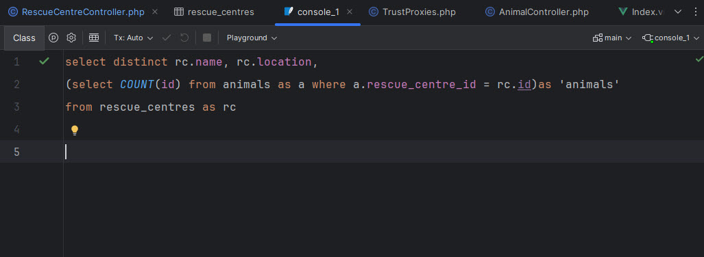
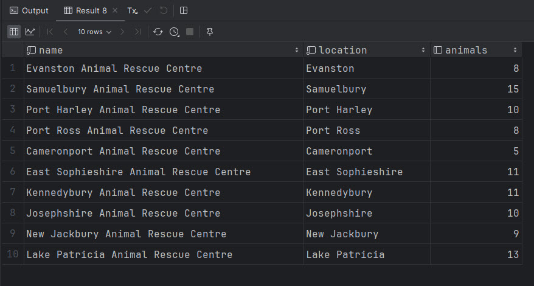
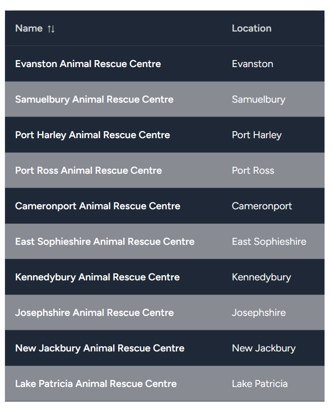
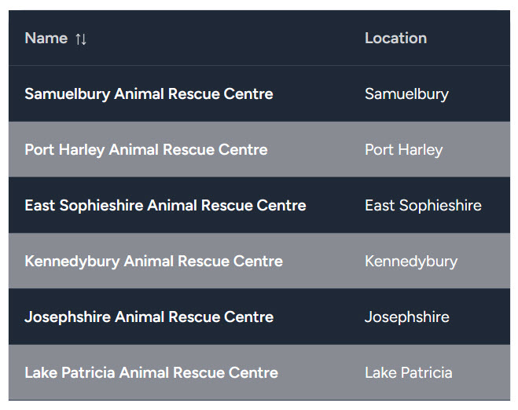

# Eloquent ORM

<br>

Eloquent is Laravel's Object Relational Mapper. Without going into too much technical detail ORM's take care of handling the necessary interaction with the database. This avoids the need for you to have to continually make connections, fetch and return data (via custom SQL queries) and finally close connections to the database.

It is recommended that you read through the documentation on Eloquent in the Laravel documentation which can be found [here](https://laravel.com/docs/10.x/eloquent).

<br>

## Querying Tables

<br>

Before we get started on this section let's use another of the great features of PhpStorm (namely it's ability to interrogate all types of database) to run a quick query on the database in our application.

<br>



<br>

Which produces the following results;

<br>



<br>

We've already seen Eloquent queries in action in the RescueCentreController;

<br>

```php
 public function index()
    {
        $rescueCentres = RescueCentre::all();
        return Inertia::render('RescueCentres/Index', ['rescueCentres' => $rescueCentres]);
    }
```

<br>

In the example above we used the `all()` function on the RescueCentre model to return all of the rescue centres that were stored in the database. This shows up as this in our view;

<br>



<br>

Now suppose that we wanted to list only those rescue centres that currently have more that ten animals. We can do so in the following way.

<br>

```php
 public function index()
    {
        $rescueCentres = RescueCentre::has('animals', '>=',10)->get();
        return Inertia::render('RescueCentres/Index', ['rescueCentres' => $rescueCentres]);
    }
```

<br>

What we have above is a query that is population the collection of rescue centres that we wish to be returned with those centres that have more than or equal ten animals in them which shows up as this is our view;

<br>



<br>

Both of the above can be cross checked against our original SQL query that we ran in Php Storm and verified as being accurate representations of the data in the database.

For a seasoned practitioner of SQL the Eloquent syntax may seem a little odd but it does at least have a certain logical type of syntax to it and is probably a lot easier to follow than standard SQL for those people not fluid in SQL.

<br>

### Exercise

<br>

This may very well prove to be the most complex thing you have yet to master in the application so take some time, if you're lucky enough to be using PhpStorm to experiment writing SQL queries that you can then convert into Eloquent queries to display in your view. Remember that for the time being these will need to be queries that return rescue centres as the result but you can query those on both the animals (and their respective types), that they contain. Moreover when you've mastered that you could take it one stage further and create queries based on whether or not the animals in question are available to be fostered or adopted.

This won't be an easy exercise but you'l definitely have learnt a lot about querying with Eloquent once you're done.

<br>

## Query efficiency

<br>

One of the most important things to do as you start to create the various queries that will power the vies in your application is to ensure that the queries that you create run efficiently.
