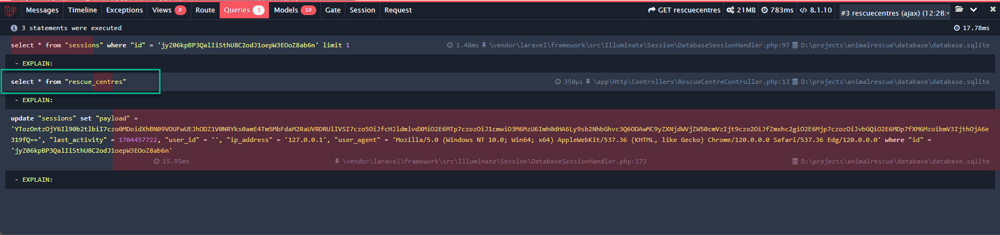
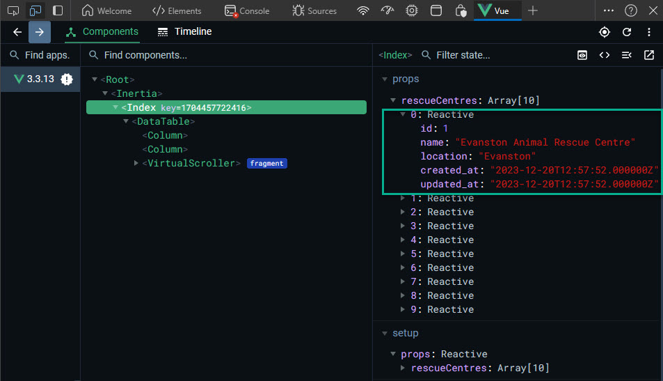
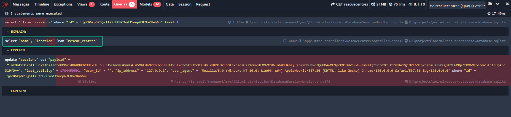
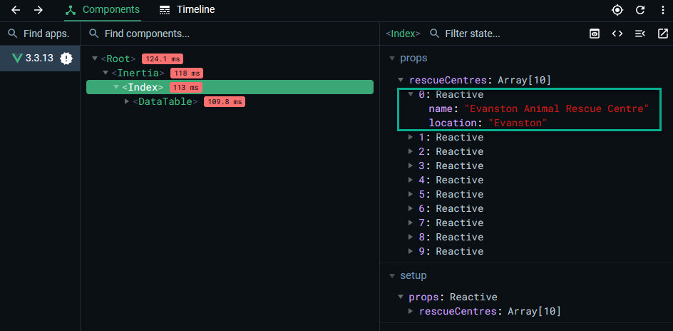

<br>

Eloquent is Laravel's Object Relational Mapper. Without going into too much technical detail ORM's take care of handling the necessary interaction with the database. This avoids the need for you to have to continually make connections, fetch and return data (via custom SQL queries) and finally close connections to the database.

It is recommended that you read through the documentation on Eloquent in the Laravel documentation which can be found [here](https://laravel.com/docs/10.x/eloquent).

<br>

## Querying Tables

<br>

Before we get started on this section let's use another of the great features of PhpStorm (namely it's ability to interrogate all types of database) to run a quick query on the database in our application.

<br>


<br>

Which produces the following results;

<br>


<br>

We've already seen Eloquent queries in action in the RescueCentreController;

<br>

```php
 public function index()
    {
        $rescueCentres = RescueCentre::all();
        return Inertia::render('RescueCentres/Index', ['rescueCentres' => $rescueCentres]);
    }
```

<br>

In the example above we used the `all()` function on the RescueCentre model to return all of the rescue centres that were stored in the database. This shows up as this in our view;

<br>


<br>

Now suppose that we wanted to list only those rescue centres that currently have more that ten animals. We can do so in the following way.

<br>

```php
 public function index()
    {
        $rescueCentres = RescueCentre::has('animals', '>=',10)->get();
        return Inertia::render('RescueCentres/Index', ['rescueCentres' => $rescueCentres]);
    }
```

<br>

What we have above is a query that is population the collection of rescue centres that we wish to be returned with those centres that have more than or equal ten animals in them which shows up as this is our view;

<br>


<br>

Both of the above can be cross checked against our original SQL query that we ran in Php Storm and verified as being accurate representations of the data in the database.

For a seasoned practitioner of SQL the Eloquent syntax may seem a little odd but it does at least have a certain logical type of syntax to it and is probably a lot easier to follow than standard SQL for those people not fluid in SQL.

<br>

### Exercise

<br>

This may very well prove to be the most complex thing you have yet to master in the application so take some time, if you're lucky enough to be using PhpStorm to experiment writing SQL queries that you can then convert into Eloquent queries to display in your view. Remember that for the time being these will need to be queries that return rescue centres as the result but you can query those on both the animals (and their respective types), that they contain. Moreover when you've mastered that you could take it one stage further and create queries based on whether or not the animals in question are available to be fostered or adopted.

This won't be an easy exercise but you'l definitely have learnt a lot about querying with Eloquent once you're done.

<br>

## Query efficiency

<br>

One of the most important things to do as you start to create the various queries that will power the views in your application is to ensure that the queries that you create run efficiently.

<br>

### Measuring efficiency

<br>

In order to make efficiency savings we're first going to need a means to actual measure just how efficient what we have is. Fortunately there is a great tool that will help you [Laravel Debugbar](https://github.com/barryvdh/laravel-debugbar).

Follow the instructions provided to install the tool and if you want a primer on how to use it then the following [YouTube Video](https://www.youtube.com/watch?v=m4yGbEHwN4Q) should give you some pointers.

<br>

### Exercise

<br>

Try doing some experimentation with the Laravel Debugbar to see how it works and to get a feel for both what it does and how the information that it provides about the app can be used to make it behave behave more efficiently.

<br>

## Making the queries more efficient

<br>

Now that we have the debugbar installed lets start to look at improving what we have done so far and how it can help us when we turn our attention to creating a new view.

If you just happen to have a [Laracasts](https://laracasts.com/) subscription then you'll find that [this course](https://laracasts.com/series/eloquent-performance-patterns) will be of immense benefit. It is classed as an 'Advanced' course implying that you'll need to have a good working knowledge of the whole subject of querying databases. If you're a complete novice in that field then this course is probably not for you just yet but on the other hand if you are reasonably proficient in SQL but perhaps not so in Eloquent queries then you'll find this a fascinating course from which you can learn a great deal.

<br>

### The 'index' queries

<br>

Generally these will be the queries that return all of the records from a particular table. In out first example of this we had a `$rescueCentres = RescueCentre::all();` in the index function of the RescueCentreController.

This is effectively the equivalent of ` Select * from rescue_centres` a fact confirmed by the Laravel Debugbar.

<br>



<br>

Whilst `::all()` has produced all the records for us it really has as is implied by its name produced 'All' of the records.

<br>



<br>

Whilst there may not be much to each one of the rescue centre records that's only because we defined very few fields for it. In real life there would be many more fields and some of them may well contain confidential information.

In reality we are only interested in displaying the name and location of the rescue centres so let's refactor our eloquent query to reflect that fact.

<br>

```php
$rescueCentres = RescueCentre::query()
            ->select(['name','location'])
            ->get();
```

<br>

If we save and refresh the view we now see the following:

<br>



<br>



<br>

Our optimised query has returned only those fields that we are interested in viewing. Had there been sensitive information in other fields of each record it would have been kept safe from prying eyes. You should also notice, on close examination of the debugbar an improvement in both the view rendering time and the query execution time.

The first lesson to takeaway from this is that , wherever possible, only those records (and fields within said records) that are actually required should be returned. The quesries themselves should run faster and there is less likelihood of exposing yourself to a [Sql Injection](https://www.w3schools.com/sql/sql_injection.asp) attack.
