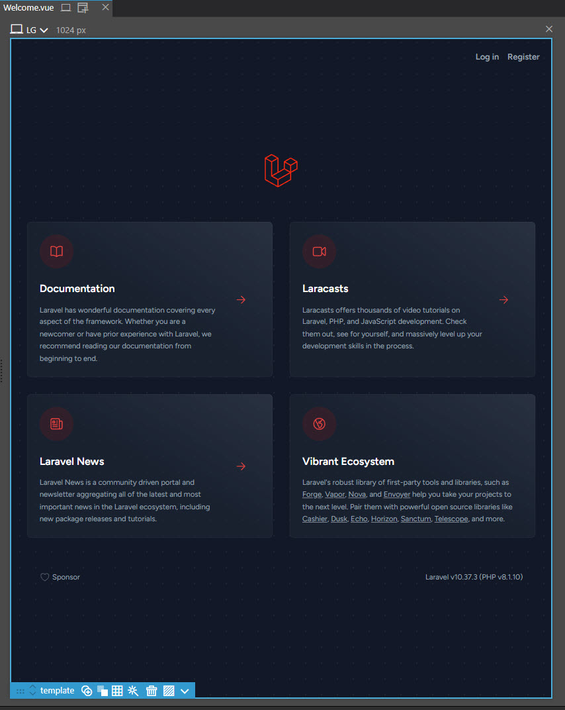

# A New Home Page (Part One)

<br>

Now that the PrimeVue components have been installed let's set about creating a new home page for our application.

As we consider what we're going to do let's remind ourselves about what the application is meant to be doing. We're creating a listings based site that can be used by animal rescue centres to list those animals that they have available for fostering or adoption.

Rescue centre staff will need to be able to log into the site in order to list their available animals (and of course de-list those for whom they find suitable homes). Potential adopters just need to be able to view the site and browse for animals that they might want to foster or adopt. Lastly we must make provision for the site administrators who need to make sure that everything is running as it should.

Three very different roles, of which at least two will be using the same basic site layout.

As you will recall we have included Jetstream in the mix because of oll the benefits that a ready made authorisation package bring to the table but it does mean that we will need to weave our requirements into what the basic app provides.

To form the basis of an idea of what we're going to do we first need to establish what we currently have.

<br>

## Examining the basic application

<br>

Open up the application in Vue designer.

> Remember to run the comands `php artisan serve` and `npm run dev` first.

It should open up on the welcome page.

<br>



<br>

At this point it is impossible to continue without first registering and or logging into site. The inbuilt authorisation that is being provided by Laravel and Jetstream is really impressive and we will want to use it but we don't really want to put potential adoptees off looking for an animal to adopt by forcing them to have to register with the site and then login.

The vast majority of people that use are application will just be browsing and that experience needs to be made as easy as possible and also as fast as possible.

What this means is that we're going to have to provide a home page for the application that is welcoming and easy to use. We won't delete , as yet, what has been provided given that we know that we will require authorisation for certain features that we intend to provide but we will create a brand new home page for the app.

<br>

## Time to discover how this all works

<br>

Before we go any further we need to really understand how this application works. Laravel and Inertia is really all about Links and Routing, along with some rather important naming conventions and general folder layout.

Needless to say none of this is really spelt out, or perhaps to be fair it is but in wildly disparate places and unless you're a meticulous note taker and capable of realising that you've just read something that might come in handy later on the odds are that this is the bit that's going to be the most difficult to grasp.

With that in mind here's what we're going to do to get started.

We know by now that we have a database , with tables in it and data in those tables. Let's try and display some of that data on a fresh page in the application. Nothing fancy here, no awards for making it look pretty. The goal is simple. There are ten rows of data in the rescue-centres table and we'd like to see them on a page (preferably in a table) that we can access from the main welcome page.

<br>

> At this point it would be sensible, if you've not done so already, to look at this [sample project](https://github.com/inertiajs/pingcrm). This is by far the best sample I looked at and it gave me more of an idea as to what is going on in this type of application than anything else. It didn't answer every question but it did provide enough information to enable me to ask more relevant questions of the search engines and indeed a couple of useful forums.

<br>

### Start at the end

<br>

It's perhaps a little counter intuitive but it will probably make sense if you start at what will become your final destination. You won't need to always take this approach but initially this is going to help you understand how all the Inertia plumbing actually works.

This is going to very neatly introduce the first little convention that's going to make life much easier, a well defined folder structure for our eventual views/pages.

By covention the Pages of the app are stored in the following folder;

`resources/js/Pages`

In the Pages folder add a new folder called 'RescueCentres'.

In that folder add a new file (if using PhpSorm, right click on your new folder select New/Vue component) and call it Index.

PhpStorm will scaffold out the following;

<br>

```js
<script setup>

</script>

<template>

</template>

<style scoped>

</style>
```

<br>

Within the template section add the following;

```js
<div>Welcome to the Rescue Centres</div>
```

Remember there are no prizes for design at the moment we just want to know that we've hit the right page. With that done save your work and we'll press on.

<br>

### Linking to the new page

<br>

Open up the Welcome.vue page and once it's open search the File for the word 'Sponsor'. We're going to put our new link just beneath that al it will be easy to spot. I'll be somewhere close to line number 90.

Add the following below the closing div that contains the Sponsor details;

<br>

```js
<div>
  <Link href="/rescuecentres">Rescue Centres</Link>
</div>
```

<br>

What you're looking at is a special Inertia link (you can read more about those [here](https://inertiajs.com/links)) that works some special magic to make the SPA experience better.

This bit of the link `href="/rescuecentres"` is the url that is in fact resolved, for want of a better term, by the Route. With that in mind we're now going to need a Route and we'll be adding that in the Web.php file located in the routes folder of your application.

<br>

### Creating the Route

<br>

Open up the web.php file and within it add the following;

<br>

```php
Route::get('rescuecentres',[\App\Http\Controllers\RescueCentreController::class, 'index'])
    ->name('rescuecentres');
```

<br>

What are we looking at here, once again turning to the [ineria documentation](https://inertiajs.com/routing) is going to provide some useful information.

Essentially though what we have here is a Route between the Controller for our RescueCentre model and and the location at which we're going to display it.

On our trek backwards it seems that we now need to visit the RescueCentreController.

<br>

### Getting to know the controller

<br>

If you used the Laravel Idea New Eloquent Model wizard to create you Model(s) then you could have created a Controller at the came time , there are also options to do so with `php artisan make` . Either way you will probably have ended up with something like this;

<br>

```php
<?php

namespace App\Http\Controllers;
use App\Models\RescueCentre;
use Illuminate\Http\Request;

class RescueCentreController extends Controller
{
    public function index()
    {
       return RescueCentre::all()
    }

    public function store(Request $request)
    {
        $data = $request->validate([

        ]);

        return RescueCentre::create($data);
    }

    public function show(RescueCentre $rescueCentre)
    {
        return $rescueCentre;
    }

    public function update(Request $request, RescueCentre $rescueCentre)
    {
        $data = $request->validate([

        ]);

        $rescueCentre->update($data);

        return $rescueCentre;
    }

    public function destroy(RescueCentre $rescueCentre)
    {
        $rescueCentre->delete();

        return response()->json();
    }
}
```

<br>

What we have here is a straightforward scaffolded collection of methods to show all of the Rescue Centres, one of them and to edit or delete one of them. These have been designed with basic Laravel in mind, not quite what we want with Inertia but it's a good starting point and there's not much we need to change.

In this case for the time being, as we just want to see all of the Rescue Centres we'll work with the Index method.

Alter the controller so that it looks like this.

<br>

```php
<?php

namespace App\Http\Controllers;
use App\Models\RescueCentre;
use Illuminate\Http\Request;
use Inertia\Inertia;

class RescueCentreController extends Controller
{
    public function index()
    {
        $rescueCentres = RescueCentre::all();
        return Inertia::render('RescueCentres/Index', ['rescueCentres' => $rescueCentres]);
    }

    public function store(Request $request)
    {
        $data = $request->validate([

        ]);

        return RescueCentre::create($data);
    }

    public function show(RescueCentre $rescueCentre)
    {
        return $rescueCentre;
    }

    public function update(Request $request, RescueCentre $rescueCentre)
    {
        $data = $request->validate([

        ]);

        $rescueCentre->update($data);

        return $rescueCentre;
    }

    public function destroy(RescueCentre $rescueCentre)
    {
        $rescueCentre->delete();

        return response()->json();
    }
}
```

<br>

The only method we've altered to work with Inertia is the index method. What are we doing there.

- First were creating a variable $rescueCentres which we are setting to be equal to all of the Rescue Centres stored in the rescue-centres table in the database.
- Next we are telling Inertia to render the Index view that resides in the RescueCentres folder in the Pages folder and passing to it the data we have retrieved from the table.

<br>

> Although technically we don't require it for this if you haven't already creat a RescueCentreResponse (essentially a function that returns a Rescue centre in json format)
>
> It should look something like this;
>
> <br>
>
> ```php
> <?php
>
> namespace App\Http\Resources;
>
> use Illuminate\Http\Request;
> use Illuminate\Http\Resources\Json\JsonResource;
>
> /** @mixin \App\Models\RescueCentre */
> class RescueCentreResource extends JsonResource
> {
>    public function toArray(Request $request): array
>    {
>        return [
>            'id' => $this->id,
>            'name' => $this->name,
>            'location' => $this->location,
>            'created_at' => $this->created_at,
>            'updated_at' => $this->updated_at,
>        ];
>    }
> }
> ```

<br>

With that all done save your work.

Run the following two commands;

`php artisan serve`
`npm run dev`

At the bottom of the welcome page you should see your new Rescue Centre link and if you click on that you should be taken to the new view that you created displaying just your welcome message.

Now let's do something about seeing the actual data.

<br>

## Displaying data on the new page

## A new home page

<br>

### Creating the layout

<br>

In the resources/js/Layouts folder create a new file MainLayout.vue

Truthfully the actual name is academic (the file extension however isn't) but as it's the intension to use this layout everywhere then MainLayout is at least self explanatory.

With that created scaffold ot the absolute basics.

<br>

```js
<script setup>
</script>

<template>
</template>
```

<br>
