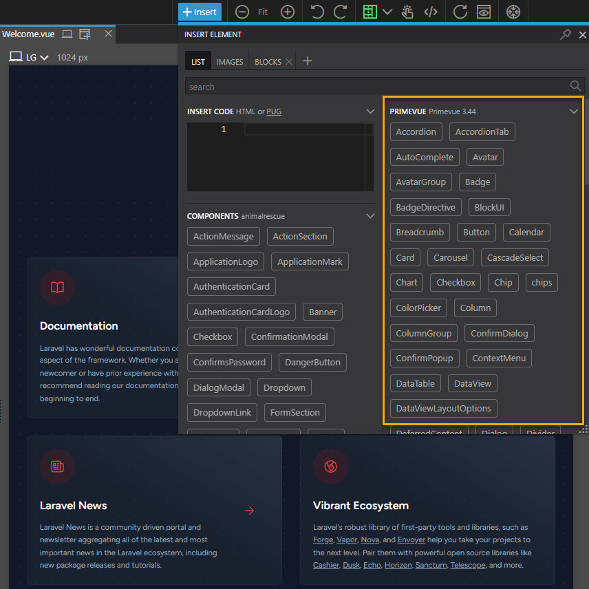
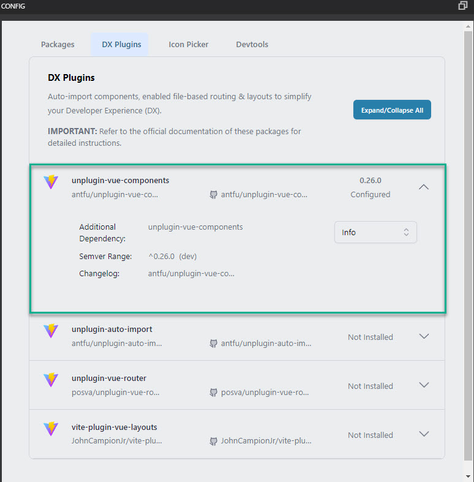

# Installing PrimeVue

<br>

## Laravel / Inertia

<br>

### Stage one

<br>

This section is going to go through the installation process to get the PrimeVue components into your application and installed as a library in Vue Designer itself.

> If you intend following along then start by cloning the DataModelsAndMigrations fork of the repository.

Begin by installing PrimeVue itself. At the terminal execute the following command.

<br>

```
npm install primevue
```

<br>

The next thing to do is go to [this site](https://github.com/primefaces/primevue-tailwind/releases) and download the latest primevue-tailwind-presets-xxx.zip file.

Extract the contents of that file to the 'resources/js' folder in your application. You should end up with a new presets folder in that directory which will itself contain a folder called 'Lara' and another one called 'Wind'.

<br>

### Stage two

<br>

Locate the app.js file in the application and add the following two lines to the imports section.

<br>

```js
import PrimeVue from "primevue/config";
import Lara from "../js/presets/lara";
```

<br>

> Two points to note about that. The first is that you could have `js import Lara from '@/presets/lara';` Both are syntactically the same as @ represents the resources/js folder.
>
> The second is that if you prefer to use the Wind preset as opposed to the Lara preset then you would substitute Wind for Lara.

<br>

Next amend the createInertiaApp section so that it looks like this.

<br>

```js
createInertiaApp({
  title: (title) => `${title} - ${appName}`,
  resolve: (name) =>
    resolvePageComponent(
      `./Pages/${name}.vue`,
      import.meta.glob("./Pages/**/*.vue")
    ),
  setup({ el, App, props, plugin }) {
    return createApp({ render: () => h(App, props) })
      .use(plugin)
      .use(ZiggyVue)
      .use(PrimeVue, { unstyled: true, pt: Lara })
      .mount(el);
  },
  progress: {
    color: "#4B5563",
  },
});
```

<br>

Now move across to the tailwind.config.js file and add the follow to the theme: section.

<br>

```js
colors: {
                "primary-50": "rgb(var(--primary-50))",
                "primary-100": "rgb(var(--primary-100))",
                "primary-200": "rgb(var(--primary-200))",
                "primary-300": "rgb(var(--primary-300))",
                "primary-400": "rgb(var(--primary-400))",
                "primary-500": "rgb(var(--primary-500))",
                "primary-600": "rgb(var(--primary-600))",
                "primary-700": "rgb(var(--primary-700))",
                "primary-800": "rgb(var(--primary-800))",
                "primary-900": "rgb(var(--primary-900))",
                "primary-950": "rgb(var(--primary-950))",
                "surface-0": "rgb(var(--surface-0))",
                "surface-50": "rgb(var(--surface-50))",
                "surface-100": "rgb(var(--surface-100))",
                "surface-200": "rgb(var(--surface-200))",
                "surface-300": "rgb(var(--surface-300))",
                "surface-400": "rgb(var(--surface-400))",
                "surface-500": "rgb(var(--surface-500))",
                "surface-600": "rgb(var(--surface-600))",
                "surface-700": "rgb(var(--surface-700))",
                "surface-800": "rgb(var(--surface-800))",
                "surface-900": "rgb(var(--surface-900))",
                "surface-950": "rgb(var(--surface-950))",
            },
```

<br>

Now open the app.css file and add the following to it.

<br>

```css
:root {
  --primary-50: 236 253 245;
  --primary-100: 209 250 229;
  --primary-200: 167 243 208;
  --primary-300: 110 231 183;
  --primary-400: 52 211 153;
  --primary-500: 16 185 129;
  --primary-600: 5 150 105;
  --primary-700: 4 120 87;
  --primary-800: 6 95 70;
  --primary-900: 4 78 56;
  --primary-950: 2 44 34;
  --surface-0: 255 255 255;
  --surface-50: 249 250 251;
  --surface-100: 243 244 246;
  --surface-200: 229 231 235;
  --surface-300: 209 213 219;
  --surface-400: 156 163 175;
  --surface-500: 107 114 128;
  --surface-600: 75 85 99;
  --surface-700: 55 65 81;
  --surface-800: 31 41 55;
  --surface-900: 17 24 39;
  --surface-950: 8 8 8;
}
```

<br>

Finally it's time to check our progress in Vue Designer.

At the terminal run the following commands and then open the project in Vue Designer.

<br>

```
php artisan serve
npm run dev
```

<br>

Click on the Insert button on the Toolbar. If all ahs gone according to plan you should see the PrimeVue components listed.

<br>



<br>

### Stage three

<br>

Now we need to complete another configuration step in Vue Designer.

Open the Config panel. and seek out the highlighted section.

<br>



<br>

Begin by running the following command at the terminal.

<br>

```
npm install unplugin-vue-components@latest -D
```

<br>

Now return to the vite.config.js file and add the following section to the plugins array;

<br>

```js
   AutoImportComponents({
            /* Please ensure that you update the filenames and paths to accurately match those used in your project. */

            dirs: ["resources/js/Components"],

            // allow auto load markdown components under ./src/components/
            extensions: ["vue", "md"],

            // allow auto import and register components used in markdown
            include: [/\.vue$/, /\.vue\?vue/, /\.md$/],

            resolvers: [PrimeVueResolver()], // Auto-import using resolvers
            dts: "components.d.ts",
        }),
```

<br>

Move back to the top of the file and add the following lines to the import section.

<br>

```js
import AutoImportComponents from "unplugin-vue-components/vite";
import { PrimeVueResolver } from "unplugin-vue-components/resolvers";
```

<br>

Two last little bits to go.

Return to the tailwind.config.js file and add the following line to the content: array

<br>

```js
 "./resources/js/presets/**/*.js",
```

 <br>

Finally open the jsconfig.json file and add the following include array.

<br>

```json
  "include": [
        //...
        /* Please ensure that you update the filenames and paths to accurately match those used in your project. */

        "components.d.ts"
    ],
```

<br>

Congratulations, you've now installed the PrimeVue components.
